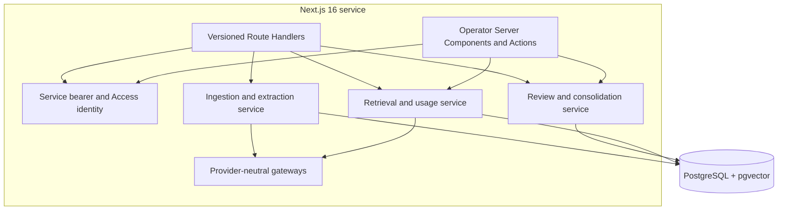

# Architecture

## Service boundary

Axelyn Knowledge owns sources, graph nodes and edges, extraction attempts, human review, revisions, retrieval activation, contradictions, usage, workspace isolation, and API identity. Operational records such as Signal pipeline runs, draft sessions, publication workflows, and deliveries remain in their source systems. Their only representation here is an immutable source identity and snapshot:

`workspace_id + source_system + source_type + external_id + source_version`

The identity is unique. An advisory transaction lock serializes concurrent calls for the same identity. A replay with identical content, metadata, occurrence time, and verification assertion returns the existing source; any changed immutable field is a conflict and requires a new source version.

## Runtime components

Route Handlers use current App Router request primitives. Operator forms use Server Actions and repeat authentication within every action. UI pages call domain services directly on the server; service consumers use only the bearer API.

## Transaction boundaries

- Ingestion commits the immutable source before any external model call.
- Applying extracted proposals is one transaction: all nodes, edges, excerpts, versions, and the success record commit together or none do.
- Approved revisions receive a deterministic `ARTIFACT` anchor, and every extracted reusable idea is connected to it with sourced `EXPRESSED_IN` provenance.
- Review transitions write the current row and a new version together.
- Merge locks both nodes, rejects known contradictions, copies provenance, preserves an alias, rewrites or archives affected edges, records versions, and emits an outbox event in one transaction.
- Retrieval records the run, selected paths, score components, context pack, and initial `SUPPLIED` usage together.
- Usage feedback and its capped usefulness update commit together.

External model calls deliberately occur outside database transactions. They cannot hold locks or create half-applied graph state.

## Provider isolation

`KnowledgeExtractionGateway` and `EmbeddingGateway` are small interfaces. The default extraction adapter uses OpenRouter-compatible chat completions with strict JSON schema output. Embeddings use an independently configured OpenAI-compatible endpoint. Neither model name nor key is compiled into the application.

Missing extraction configuration produces a durable failed attempt while source ingestion succeeds. Missing or failed embeddings use lexical and graph retrieval. Tests inject fakes and never call paid APIs.

## Dependency posture

The runtime intentionally stays close to the platform: Next.js/React, the mature `pg` client, Zod at trust boundaries, and `node-pg-migrate` for explicit reversible SQL. There is no ORM, graph database client, queue framework, visualization package, or second vector client. The two font packages self-host the administration typography without runtime requests. Vitest, Playwright, TypeScript, ESLint, Prettier, and `tsx` are development-only tooling.

## Outbox and future workers

Domain transactions append events to `outbox_events`. The MVP does not publish them automatically; a future worker can claim unpublished rows with `FOR UPDATE SKIP LOCKED`, publish idempotently, and update `published_at`. The same worker boundary can process asynchronous extraction, embeddings, and consolidation without changing table ownership.

## Consolidation design

No autonomous consolidation process runs in v1. The necessary primitives already exist:

- statement hashes and normalized forms for exact candidates;
- optional vector similarity for suggestions;
- proposal metadata containing candidate and contradiction IDs;
- immutable source excerpts;
- aliases, merge history, node and edge versions;
- explicit `SUPERSEDES` and `CONTRADICTS` relationships;
- capped usefulness, recency decay, lifecycle archival, and outbox events.

A future consolidation worker should generate a review batch, never merge solely on similarity, exclude contradictory pairs, and require an operator decision before the existing transactional merge primitive runs.
